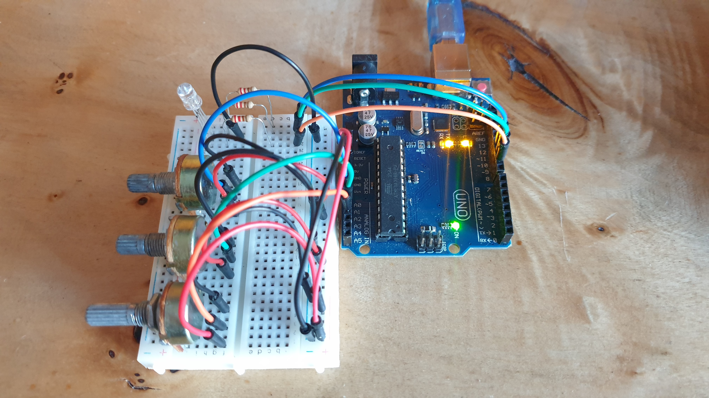
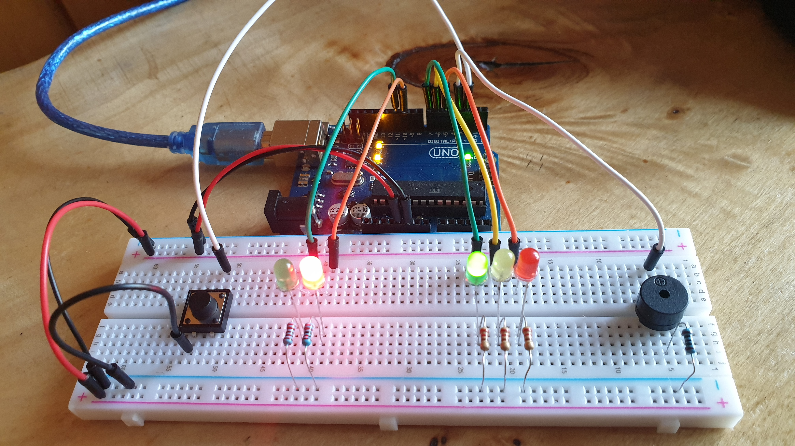
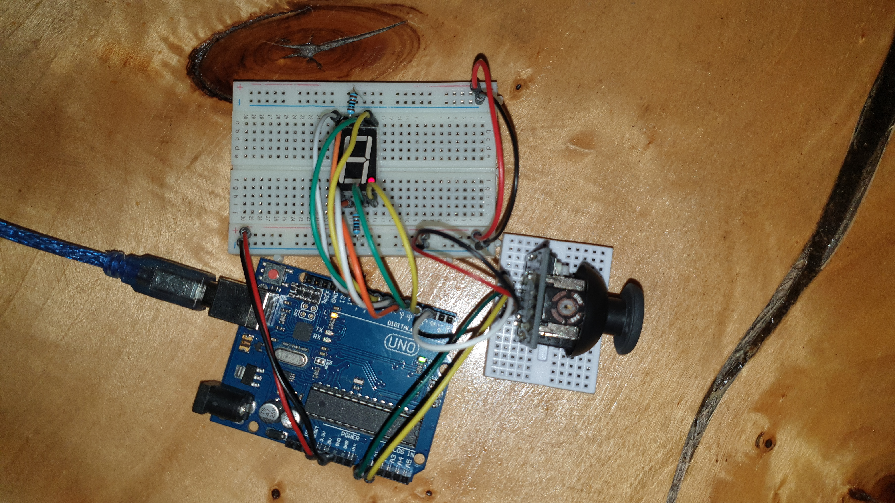
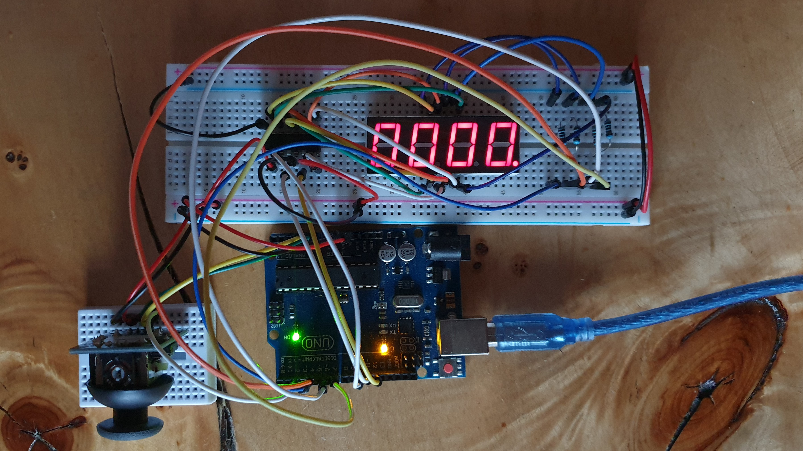
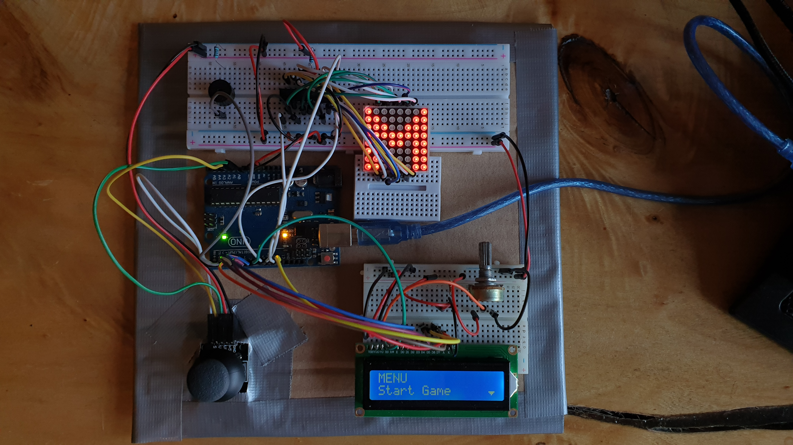

# Introduction To Robotics (2022 - 2023)

Introduction to Robotics laboratory homework, taken in the 3rd year at the Faculty of Mathematics and Computer Science, University of Bucharest. Each homework includes requirements, implementation details, code and image files.

### [Homework #1](../master/Homework1.ino) 

 <b>Task Requirements</b> 
 

Control a RGB led using 3 potentiometers.

 <b>Picture</b> 
 

 <b>Video</b> 
 

### [Homework #2](../master/Homework2.ino)

 <b>Task Requirements</b> 
 

Build the traffic lights for a crosswalk using: 
* 2 LEDs to represent the traffic lights for people (red and green)
* 3 LEDs to represent the traffic lights for cars (red, yellow and green)

 

The system will go through 4 states:
* STATE 1
  + Trigger : None (default state)
  + Cars : GREEN
  + People : RED
  + Sound : None
  + Duration : inf
  
* STATE 2
  + Trigger: 8 seconds after the push button is presses while in STATE 1
  + Cars : YELLOW
  + People : RED
  + Sound : None
  + Duration : 3 seconds
  
* STATE 3
  + Trigger : after STATE 2 has ended
  + Cars : RED
  + People : GREEN
  + Sound : Buzzer beeping
  + Duration : 8 seconds
  
* STATE 4
  + Trigger : after STATE 3 has ended
  + Cars : RED
  + People : GREEN BLINKING
  + Sound : Buzzer beeping faster
  + Duration : 4 seconds

 

Additional info:
* After STATE 4 has ended, the default state (STATE 1) is reinstated.
* Pressing the button in any state other than state 1 should NOT yield any actions.
* The program is implemented without using delay().

 <b>Picture</b> 
 

 <b>Video</b> 
 

### [Homework #3](../master/Homework3.ino) 

 <b>Task Requirements</b> 
 

Draw on a 7-segment display using a joystick.

 

The system will go through 2 states:
* STATE 1
  + Trigger : Default state (also initiated after a button press in STATE 2)
  + Current position : Blinking
  + Joystick movement (X and Y axis) : Move current position to one of the neighbors
  + Short button press : Toggle STATE 2
  + Long button press : Reset the system - segments turn OFF and current position goes to decimal point
  
* STATE 2
  + Trigger: Initiated after a button press in STATE 1
  + Current position : The value of the segment
  + Joystick movement (X axis) : Change the value of the segment (from ON to OFF or from OFF to ON)
  + Short button press : Exit back to STATE 1
  + Long button press : No action

 

Neighbors based on the current segment and joystick movement:

| Current segment |  UP | DOWN | LEFT | RIGHT |
|:---------------:|:---:|:----:|:----:|:-----:|
|      **a**      | N/A |   g  |   f  |   b   |
|      **b**      |  a  |   g  |   f  |  N/A  |
|      **c**      |  g  |   d  |   e  |   dp  |
|      **d**      |  g  |  N/A |   e  |   c   |
|      **e**      |  g  |   d  |  N/A |   c   |
|      **f**      |  a  |   g  |  N/A |   b   |
|      **g**      |  a  |   d  |  N/A |  N/A  |
|      **dp**     | N/A |  N/A |   c  |  N/A  |

 <b>Picture</b> 
 

 <b>Video</b> 
 

### [Homework #4](../master/Homework4.ino) 

 <b>Task Requirements</b> 
 

Move through a 4 digit 7-segment display and increment/decrement the numbers using a joystick.

 

The system will go through 2 states:
* STATE 1
  + Trigger : Default state (also initiated after a button press in STATE 2)
  + Current position : Dp segment of digit blinking
  + Joystick movement (Y axis) : Cycle through digits
  + Short button press : Toggle STATE 2
  + Long button press : Reset the system - digits reset to zero and current position goes to the first digit
  
* STATE 2
  + Trigger: Initiated after a button press in STATE 1
  + Current position : Dp segment of digit stays on
  + Joystick movement (X axis) : Increment/decrement the number of the current digit in HEX (from 0 to F)
  + Short button press : Exit back to STATE 1
  + Long button press : No action

 <b>Picture</b> 
 

 <b>Video</b> 
 

### [Homework #5](../master/Homework5) 

 <b>Task Requirements</b> 
 

 <b>Picture</b> 
 

 <b>Video</b> 
 

